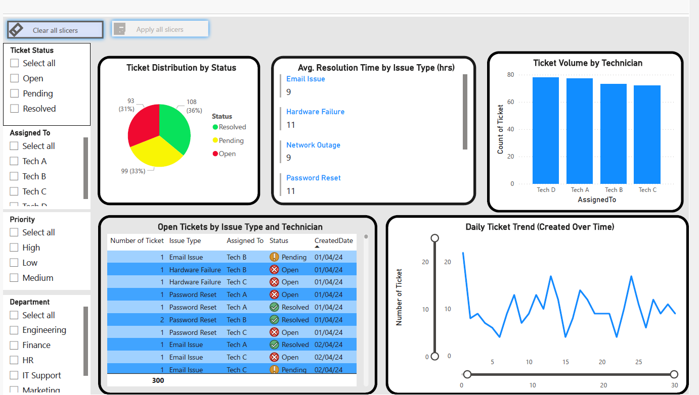

#  Helpdesk Ticket Analytics Dashboard (IT Support Project)

This project simulates a real-world IT Support environment, where a helpdesk team handles, tracks, and resolves service tickets across multiple departments. It demonstrates how Power BI can be used to monitor ticket trends, technician performance, and issue resolution efficiency,empowering IT teams to improve service delivery.

---

##  Goal

To turn helpdesk data into actionable insight through interactive dashboards for real-time visibility, smarter staffing, and faster resolution.

---

##  Use Case

IT teams in medium to large organizations receive dozens of service tickets daily. Without visibility into status, resolution time, and technician workload, it's hard to manage support performance effectively.

This dashboard enables:

-  Real-time oversight of ticket volumes and trends  
-  Visibility into resolution delays and bottlenecks  
-  Insight into technician workloads  
-  Departmental filtering and issue type breakdown  

This tool could be used by a Service Desk Manager to reduce backlogs, improve SLA compliance, and make smarter staffing decisions.

---

## Key Features

| Feature                   | Description                                                                 |
|---------------------------|-----------------------------------------------------------------------------|
|  Interactive Filtering   | Drill down by status, priority, department, or technician                  |
|  Real-Time Overview     | Key metrics: open, resolved, pending, and overdue tickets                  |
|  Performance KPIs       | Avg. resolution time by issue type                                         |
|  Trend Analysis         | Daily ticket creation trend line                                           |
| Technician Load Insights | Ticket count by assigned technician                                       |
| Open Tickets Breakdown | Table of unresolved issues with full context                               |

---

## 📷 Dashboard Preview

>  A static dashboard image is available in the `/images` folder.

  A full PDF snapshot is also available:  
➡ [Download Dashboard PDF](Helpdesk_Ticket_Analytics.pdf)

---

##  Live Interactive Dashboard

Explore the live Power BI dashboard:

 🔗 [View Public Dashboard (Power BI)](https://app.powerbi.com/view?r=eyJrIjoiOTExZTVhNmYtZDA1My00ZjU2LTlmM2MtYTYyMjk0ODhkNDgzIiwidCI6ImZlMDJjYzBmLTUzZjktNDg2ZC05ODM3LTUxMDlhZDVhN2E3ZiJ9)

> Test filters, click visual elements, and interact with slicers to simulate real-time support monitoring.

---

##  Dataset

-  300+ synthetic helpdesk ticket records  
-  Fields include: Issue Type, Department, Technician, Priority, Creation Date, Resolution Time  

>  **Privacy Note**: All data used in this project is **synthetically generated** and does **not represent any real users or companies**.

---

##  Tools and Skills Demonstrated

- Power BI Desktop & Power BI Service  
- DAX formulas for KPIs  
- Data modeling for support workflows  
- UX-focused dashboard design  
- Power BI Gateway setup *(optional for real-time refresh)*

---

##  Disclaimer

This dashboard is developed for **portfolio and educational demonstration** purposes only.  
All ticket entries are **fictitious and randomly generated** to protect privacy.  
Any similarity to real organizations or users is purely coincidental.

---

## Author

**Adekunle Felix Taiwo**  
🔗 [LinkedIn](https://www.linkedin.com/in/felixtaiwo)  
📂 [Other Projects](https://github.com/TAdekunleF)  
